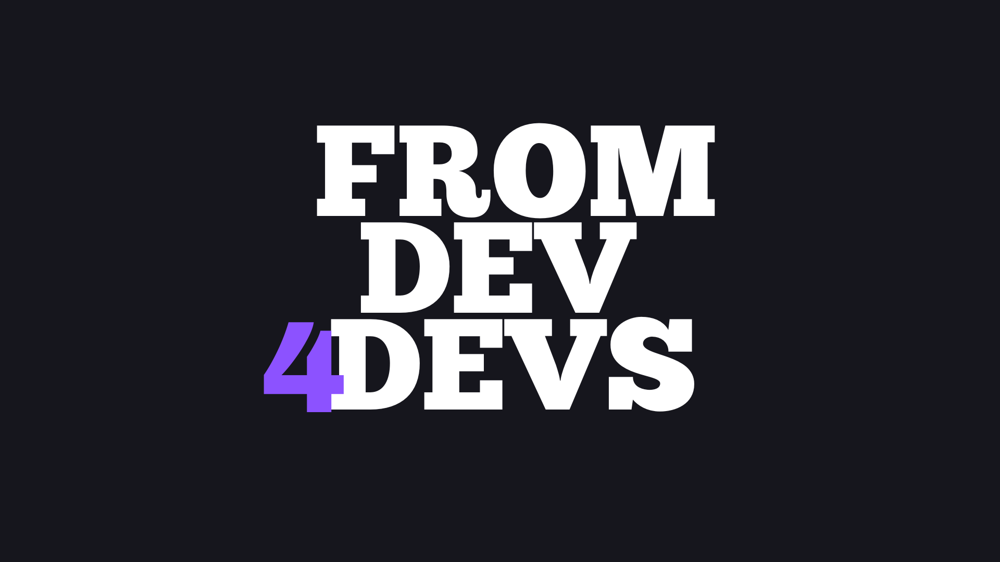

<div align="center">



# FD4D (From Dev 4 Devs)

### 🚀 Toolkit Desktop para Desenvolvedores

[](https://github.com/VictorVilelaSilva/FD4D/releases)
[](https://tauri.app/)
[](https://react.dev/)
[](LICENSE)

**FD4D** é um aplicativo desktop nativo que reúne ferramentas essenciais para o dia a dia de desenvolvedores. Construído com **Tauri v2**, oferece performance nativa com interface moderna e intuitiva.

[🔽 Download](#-downloads) • [📋 Recursos](#-recursos) • [🛠️ Desenvolvimento](#%EF%B8%8F-desenvolvimento) • [📖 Documentação](AGENTS.md)

</div>

---

## 🔽 Downloads

<div align="center">

### [📦 Página de Releases](https://github.com/VictorVilelaSilva/FD4D/releases/latest)

| Plataforma | Formato | Link Direto (v3.1.0) |
|:----------:|:-------:|:--------------------:|
| 🪟 **Windows** | `.msi` | [Download MSI](https://github.com/VictorVilelaSilva/FD4D/releases/download/v3.1.0/FD4D_3.1.0.msi) |
| 🪟 **Windows** | `.exe` | [Download EXE](https://github.com/VictorVilelaSilva/FD4D/releases/download/v3.1.0/FD4D_3.1.0.exe) |
| 🐧 **Linux** | `.deb` | [Download DEB](https://github.com/VictorVilelaSilva/FD4D/releases/download/v3.1.0/FD4D_3.1.0.deb) |
| 🐧 **Linux** | `.rpm` | [Download RPM](https://github.com/VictorVilelaSilva/FD4D/releases/download/v3.1.0/FD4D-3.1.0.rpm) |
| 🐧 **Linux** | `.AppImage` | [Download AppImage](https://github.com/VictorVilelaSilva/FD4D/releases/download/v3.1.0/FD4D_3.1.0.AppImage) |
| 🍎 **macOS** | `.dmg` | [Download DMG](https://github.com/VictorVilelaSilva/FD4D/releases/download/v3.1.0/FD4D_3.1.0.dmg) |

</div>

---

## ✨ Recursos

<table>
<tr>
<td width="50%">

### 🆔 Gerador & Validador CPF/CNPJ
- ✅ Geração de CPF e CNPJ válidos
- 🔍 Validação com feedback visual
- 📋 Cópia rápida com animação
- 🎭 Formatação automática (com/sem máscara)

</td>
<td width="50%">

### 🪝 Servidor de Webhook
- 🔌 Servidor HTTP local configurável
- 🔐 Múltiplos métodos de autenticação
- 📊 Histórico de requisições em tempo real
- 🎨 Interface com status colorido

</td>
</tr>
<tr>
<td width="50%">

### 🎨 Color Picker
- 🖱️ Captura de cores da tela
- 🐧 Suporte nativo para Wayland
- 📋 Cópia automática para clipboard
- 🔄 Múltiplos formatos (HEX, RGB, HSL)

</td>
<td width="50%">

### 🎭 Interface Moderna
- 🌈 Tema escuro com gradientes roxos
- ✨ Animações suaves (Motion.js)
- 🎯 Componentes personalizados
- 📱 Design responsivo

</td>
</tr>
</table>

---

## 🛠️ Stack Tecnológica

<div align="center">

| Frontend | Backend | Build & Styling |
|:--------:|:-------:|:---------------:|
|  |  |  |
|  |  |  |
|  |  |  |

</div>

---

## 🚀 Início Rápido

### 📋 Pré-requisitos

- **Node.js** 22 ou superior
- **Rust** toolchain estável
- **npm** ou **yarn**

### ⚙️ Desenvolvimento

```bash
# 1. Clone o repositório
git clone https://github.com/VictorVilelaSilva/FD4D.git
cd FD4D

# 2. Instale as dependências
npm install

# 3. Inicie o modo de desenvolvimento
npm run tauri dev
```

### 📦 Build de Produção

```bash
# Build completo (frontend + backend)
npm run build
npm run tauri build

# Artefatos gerados em: src-tauri/target/release/bundle/
```

### 🔧 Comandos Úteis

| Comando | Descrição |
|---------|-----------|
| `npm run dev` | Inicia apenas o Vite dev server |
| `npm run tauri dev` | Modo desenvolvimento completo (recomendado) |
| `npm run build` | Build do frontend (TypeScript + Vite) |
| `npm run tauri build` | Build completo da aplicação |
| `npm run preview` | Preview do build de produção |

---

## 🐧 Configuração Linux/Wayland

Para o **Color Picker** funcionar corretamente no Wayland (ex: Hyprland, Nobara, Fedora), instale os portais do sistema e ferramentas de fallback:

### 📦 Dependências Necessárias

```bash
# Fedora/Nobara/RHEL
sudo dnf install xdg-desktop-portal-hyprland xdg-desktop-portal-gtk hyprpicker

# Arch Linux
sudo pacman -S xdg-desktop-portal-hyprland xdg-desktop-portal-gtk hyprpicker

# Ubuntu/Debian
sudo apt install xdg-desktop-portal-gtk hyprpicker
```

> **Nota:** Se o portal XDG não estiver ativo, o app usará `hyprpicker` como fallback automaticamente.

---

## 📚 Estrutura do Projeto

```
FD4D/
├── src/                      # Frontend React + TypeScript
│   ├── components/           # Componentes da UI
│   │   ├── CPFGenerator/     # Gerador de CPF/CNPJ
│   │   ├── ValidadorCPFCNPJ/ # Validador
│   │   ├── Webhook/          # Servidor de webhook
│   │   ├── ColorPicker/      # Color picker
│   │   └── ui/               # Componentes reutilizáveis
│   ├── lib/                  # Utilitários
│   └── styles/               # Estilos globais
├── src-tauri/                # Backend Rust
│   ├── src/
│   │   ├── lib.rs            # Comandos Tauri
│   │   ├── cpf_cnpj.rs       # Lógica CPF/CNPJ
│   │   ├── webhook.rs        # Servidor webhook
│   │   └── color_picker.rs   # Color picker
│   └── Cargo.toml            # Dependências Rust
└── .github/workflows/        # CI/CD
```

---

## 🤝 Contribuindo

Contribuições são bem-vindas! Sinta-se à vontade para:

1. 🐛 Reportar bugs
2. 💡 Sugerir novos recursos
3. 🔧 Enviar pull requests
4. ⭐ Dar uma estrela no projeto

---

## 📄 Licença

Este projeto está sob a licença MIT. Veja o arquivo [LICENSE](LICENSE) para mais detalhes.

---

<div align="center">

**Desenvolvido com 💜 por [Victor Vilela](https://github.com/VictorVilelaSilva)**

[](https://github.com/VictorVilelaSilva)

</div>
